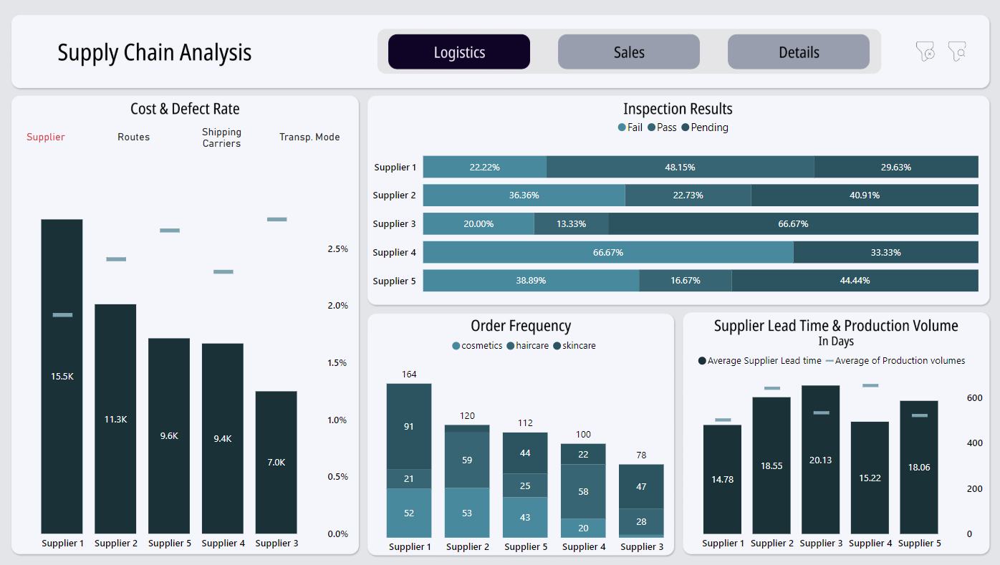
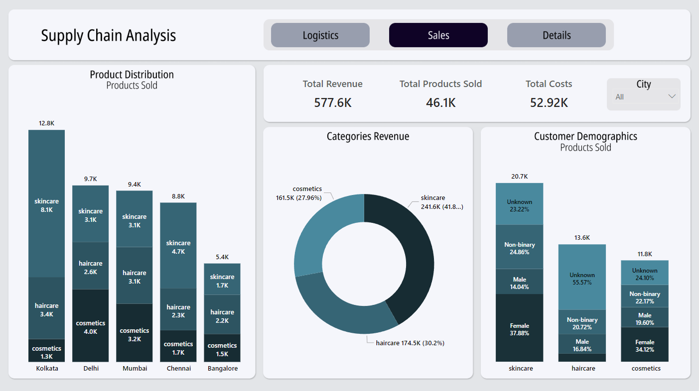
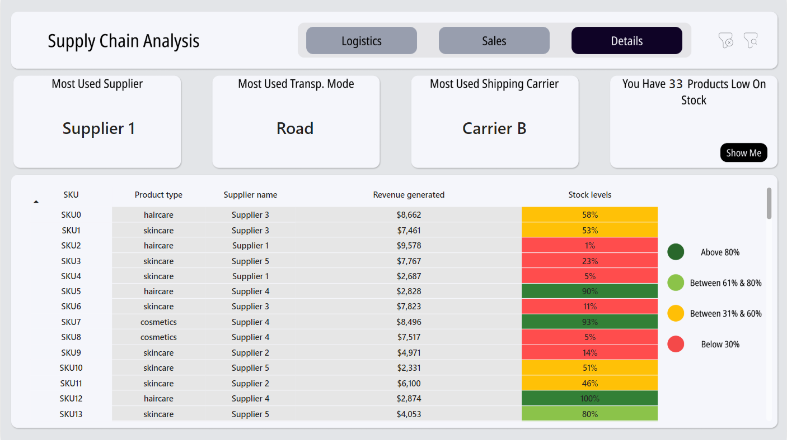

# Supply Chain Analysis

This project analyzes data from the **Supply Chain** sector. The analysis focuses on inventory levels, order fulfillment rates, and supplier performance across different regions and product categories using **Power BI** for data visualization.

---

## Project Overview

This analysis provides insights into supply chain efficiency, identifying key factors that impact inventory turnover, lead times, and overall supply chain resilience. The project aims to optimize supply chain operations and enhance decision-making processes.

## Key Objectives

-   Analyze inventory levels to identify trends and optimize stock management.
-   Assess supplier performance to ensure reliability and quality.
-   Utilize Power BI for interactive data visualization and reporting.

## Data Sources

-   Sales and inventory data
-   Supplier performance records
-   Regional and product category data

## Expected Outcomes

-   Improved inventory management strategies
-   Enhanced supplier relationship management
-   Increased order fulfillment efficiency
-   Data-driven decision-making capabilities

## Tools & Technologies

-   **Power BI**: Used for creating dashboards to analyze Kickstarter project data.
-   **Excel**: Used for data exploration
-   **Figam**: Used for dashboard UI design

---

## Dashboard

### Logistics

> **Note**: The order frequency visual includes a tooltip for additional information if needed.

### Sales

### Detailed Insights

> **Warning**: Due to Power BI logic, to view the products that are low on stock, press the `Show Me` button and then apply filters if needed.

---

### Data Analysis Insights

### Logistics Insights

#### Supplier Performance

-   **Supplier 1**: Incurs the highest costs but maintains the lowest defect rate at 1.92%, making it a reliable choice for quality-conscious categories.
-   **Supplier 3**: Offers the lowest costs but has the highest defect rate at 2.75%, raising quality concerns.
-   **Supplier 4**: Strikes a balance with the second-lowest cost and defect rate at 2.30%, potentially offering value for cost-sensitive yet quality-aware products.

#### Routes and Carriers

-   **Route C**: Provides the lowest transportation cost while maintaining defect rates comparable to other routes, presenting a cost-effective option.
-   **Carrier B**: Has the highest cost but demonstrates a significantly lower defect rate compared to its peers, offering reliability for sensitive shipments.

#### Transportation Modes

-   **Air transportation**: Boasts the lowest defect rate at 2.02%, though its cost closely aligns with higher-cost modes like rail and road.
-   **Sea transportation**: Offers a defect rate of 2.41%, slightly higher but with costs nearly half those of other modes, making it ideal for cost-sensitive bulk shipments.

#### Inspection Results

-   **Supplier 1**: Passed 48.15% of inspections, with 29.63% results still pending.
-   **Supplier 4**: Despite its low cost, failed 66.67% of inspections, with 33.33% still pending, indicating quality issues that require immediate attention.

#### Product-Specific Supplier Suitability

-   **Supplier 1**: Excels in skincare (passing 53.33%) and haircare (60%) inspections but struggles with cosmetics (failing 42.8%).
-   **Supplier 2**: Emerges as the best option for cosmetics, with the highest category success rate of 42.8%.

#### Lead Time and Production Volume

-   **Supplier 1**: Exhibits the shortest average lead time but has the lowest average production volume.
-   **Supplier 3**: Has the longest average lead time and the second-lowest production volume, impacting its ability to meet urgent demands.

#### Usage Trends

-   **Supplier 1**: Is the most frequently utilized supplier.
-   **Road transportation** And **Carrier B** are the most commonly used shipping methods.

#### Stock Levels

-   33 products are identified as low on stock, necessitating replenishment planning.

### Sales Insights

#### Regional Demand

-   **Kolkata**: Is the leading buyer of skincare products, while it ranks the lowest in cosmetics purchases.

#### Category Performance

-   **Skincare**: Is the top revenue-generating category, driven primarily by female buyers.

> **Demographic Issues**: A significant number of products lack demographic data, potentially leading to misleading insights. It is crucial to address this with the relevant department to ensure accurate segmentation and targeted strategies.

## Suggestions for Optimizing Supply Chain and Sales Strategies

### Supplier Management

-   **Negotiate with Supplier 1**: Given their high quality and extensive use, consider negotiating lower costs or volume discounts to balance expenses.
-   **Evaluate Supplier 4**: Due to their high failure rate and lack of inspection passes, consider discontinuing their services or implementing a quality improvement program.

### Transportation Strategy

-   **Air Transportation**: Utilize air shipping for high-priority or time-sensitive shipments to ensure reliability.
-   **Sea Transportation**: Increase the use of sea shipping for cost-sensitive goods, considering its lower cost despite slightly higher defect rates.
-   **Route C**: Enhance the utilization of Route C to leverage its cost efficiency without compromising on defect rates.

### Sales and Marketing

-   **Kolkata Skincare Focus**: Invest in marketing and distribution efforts in Kolkata for skincare products, aligning with their high demand.
-   **Cosmetics Sales in Kolkata**: Conduct market research to understand the low cosmetics sales in Kolkata and develop targeted marketing campaigns.
-   **Demographic Data Completion**: Initiate market research to fill gaps in demographic data for products, enhancing targeted marketing strategies.

### Inventory Management

-   **Inventory Tracking System**: Implement a more robust inventory tracking system to prevent stockouts, especially for the 33 low-stock products.
-   **Safety Stock Levels**: Consider maintaining safety stock levels for critical products to ensure continuity of supply.

### Supplier Diversification

-   **Secondary Supplier for Skincare and Haircare**: Explore options for a secondary supplier to complement Supplier 1, ensuring supply continuity.

### Performance Monitoring and Quality Improvement

-   **Supplier Performance Monitoring**: Develop a comprehensive supplier performance monitoring system to promptly identify and address issues.
-   **Quality Improvement Programs**: Implement training or audits for suppliers with higher defect rates, such as Supplier 3.

### Sustainability Considerations

-   **Environmental Impact**: Evaluate the environmental impact of transportation modes and consider shifting more cargo to sea transportation for cost and sustainability benefits.

---

## Installation and Setup

1. Download and install [Power BI Desktop](https://powerbi.microsoft.com/desktop/).
2. Open the provided `.pbix` file.
3. Refresh the data connections to load the latest Kickstarter data.
4. Explore the dashboards and apply filters to customize your analysis.
